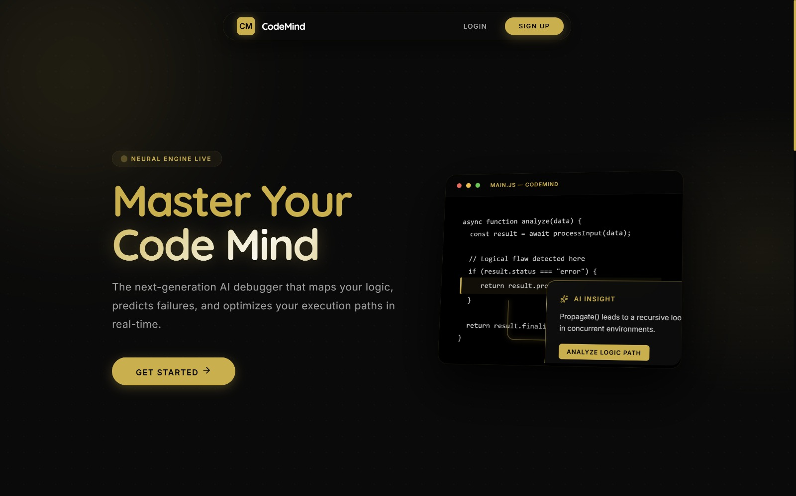
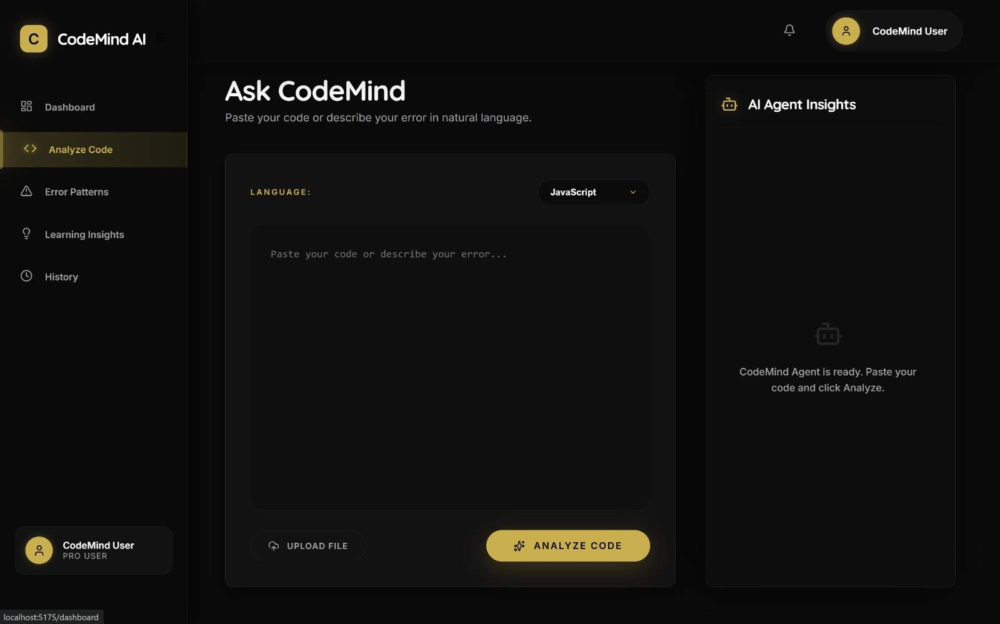
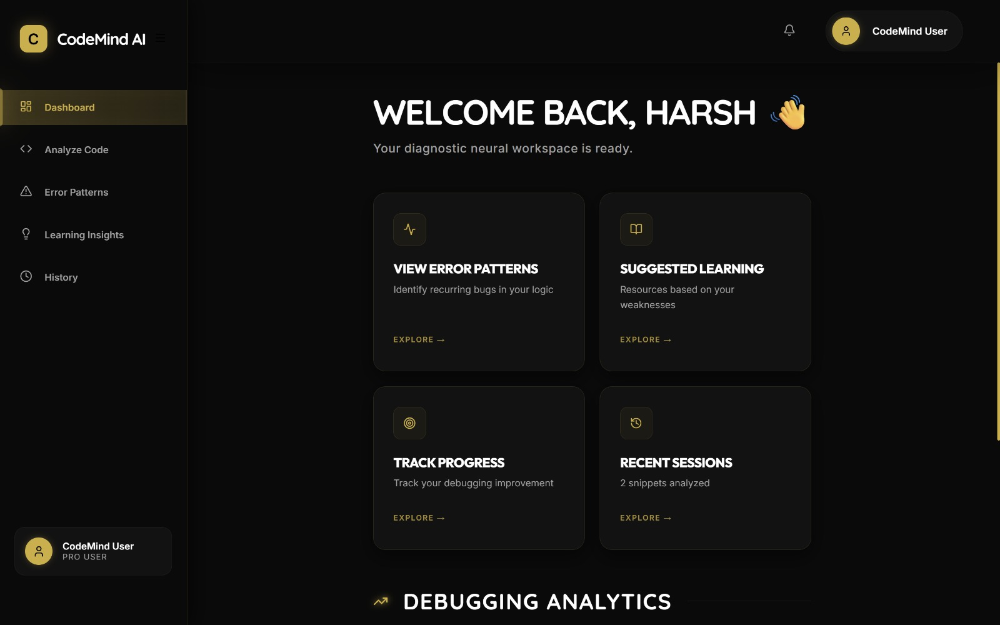
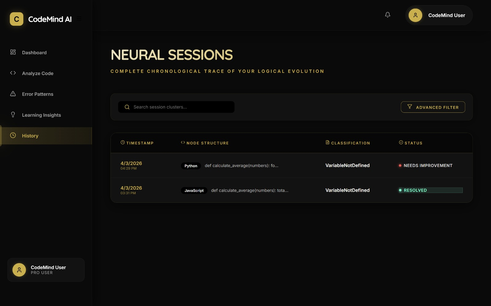

# CodeMind – Intelligent Debugging Copilot  

> Turning debugging into a learning experience by understanding how you think, not just what you code.

## Team: Ctrl Alt Elite  

**Members:**  
- Yathartha Rastogi (24BCE10410)  
- Harsh (24BSA10054)  
- Roshan Gayakawad (24BCG10086)  
- Shaili Berchha (24BAC10064)  

---

## Overview  

*Modern AI-powered debugging interface with real-time insights and logic analysis.*

CodeMind is an AI-powered debugging assistant that helps users **learn while fixing errors**. Instead of just providing solutions, it tracks user mistake patterns, predicts future errors, and delivers personalized explanations based on the user’s skill level.

---

## Problem  

Beginner developers often:  
- Repeat the same mistakes  
- Depend heavily on external help  
- Struggle to understand errors deeply  

Most existing tools solve errors but **fail to improve the user’s thinking process**.

---

## Solution  

CodeMind focuses on **learning-driven debugging** by:  
- Tracking error patterns over time  
- Predicting likely mistakes  
- Adapting explanations to the user  
- Providing both “Fix” and “Learn” modes  

---

## Tech Stack  

- **Frontend:** React 
- **Backend:** FastAPI  
- **Database:** Supabase  
- **AI Engine:** Gemini API  

---

## How It Works  

User writes code → error detected → AI analysis → pattern tracking → personalized feedback  

*AI-powered code analysis with contextual debugging insights.*

---

## Impact  

- Faster debugging  
- Better conceptual understanding  
- Reduced repeated mistakes  
- Increased confidence for beginner developers  

---

## Future Scope  

- Multi-language support  
- VS Code extension  
- Mistake history tracking  
- Collaboration features  

---

## Dashboard  

*Personalized workspace with error patterns, learning insights, and progress tracking.*

---

## History (Neural Sessions)  

*Chronological tracking of debugging sessions, error classification, and resolution status.*
